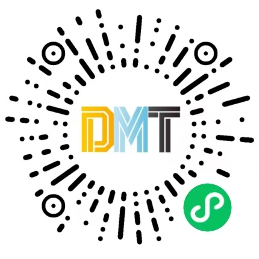

# SM-DoubleAssistant - 导师互选系统（小程序端）

浙江科技大学数媒专业导师互选系统的前端小程序，支持学生选导师、导师选学生的双向互选流程。



## 技术栈

| 类别 | 技术选型 |
|------|---------|
| 跨端框架 | [uni-app 3.0](https://uniapp.dcloud.net.cn/) (基于 [unibest](https://unibest.tech) 模板) |
| UI 框架 | [Vue 3](https://vuejs.org/) + `<script setup>` Composition API |
| 构建工具 | [Vite 5](https://vitejs.dev/) |
| UI 组件库 | [wot-design-uni](https://wot-design-uni.cn/) |
| 状态管理 | [Pinia](https://pinia.vuejs.org/) + pinia-plugin-persistedstate |
| CSS 方案 | [UnoCSS](https://unocss.dev/) (原子化 CSS) + SCSS |
| 代码规范 | ESLint + Husky + lint-staged + commitlint |
| 包管理器 | pnpm (强制) |
| 语言 | TypeScript |

**主要目标平台**: 微信小程序 (`mp-weixin`)，同时支持 H5 和 App

## 项目结构

```
SM-DoubleAssistant/
├── env/                          # 环境变量配置
│   ├── .env                      # 公共变量（AppID 等）
│   ├── .env.development          # 开发环境（localhost:7001）
│   ├── .env.production           # 生产环境（www.richardq.tech）
│   └── .env.test                 # 测试环境
├── src/
│   ├── api/                      # 接口层（按角色拆分）
│   │   ├── login.ts              # 登录 / Token 刷新
│   │   ├── stdInfo.ts            # 学生端接口
│   │   ├── teaInfo.ts            # 教师端接口
│   │   ├── useraction.ts         # 通用用户/活动接口
│   │   └── types/login.ts        # TS 类型定义
│   ├── components/               # 全局复用组件
│   │   ├── TeacherCard.vue       # 教师卡片（学生选择页使用）
│   │   └── StudentDialog.vue     # 学生详情弹窗（教师选择页使用）
│   ├── interceptors/             # 拦截器
│   │   ├── request.ts            # 请求拦截（URL 重写、Token 注入）
│   │   ├── route.ts              # 路由守卫（登录态检查）
│   │   └── prototype.ts          # 兼容性 Polyfill
│   ├── layouts/                  # 页面布局
│   │   └── default.vue           # 默认布局（全局 Toast/MessageBox）
│   ├── pages/                    # 页面目录
│   │   ├── login/login.vue       # 登录页（首页）
│   │   ├── index/index.vue       # 活动列表（主页）
│   │   ├── s_choose/index.vue    # 学生选导师
│   │   ├── t_choose/index.vue    # 教师选学生
│   │   ├── myAmbition/index.vue  # 我的志愿（学生）
│   │   ├── myStudent/index.vue   # 我的学生（教师）
│   │   ├── userMsg/index.vue     # 学生信息填写
│   │   └── resetPassword/index.vue # 重置密码
│   ├── store/                    # Pinia 状态管理
│   │   ├── index.ts              # Store 初始化 + 持久化配置
│   │   └── user.ts               # 用户状态（双 Token 管理）
│   ├── style/                    # 全局样式
│   │   └── ios.scss              # iOS 风格设计系统（CSS 变量）
│   ├── utils/                    # 工具函数
│   │   └── http.ts               # HTTP 客户端（双 Token + 自动刷新）
│   ├── constants/                # 常量配置
│   ├── App.vue                   # 根组件
│   └── main.ts                   # 入口文件
├── vite-plugins/                 # 自定义 Vite 插件
│   ├── copyNativeRes.ts          # 原生资源拷贝（App 构建）
│   └── updatePackageJson.ts      # 生产构建时写入更新时间
├── pages.config.ts               # 页面路由配置
├── manifest.config.ts            # uni-app 平台配置（AppID 等）
├── uno.config.ts                 # UnoCSS 配置
├── vite.config.ts                # Vite 构建配置
├── project.config.json           # 微信开发者工具配置
└── package.json
```

## 业务架构

### 整体流程

本系统实现 **"学生选导师 → 导师选学生"** 的两阶段双向互选机制：

```
┌─────────────────────────────────────────────────────────┐
│                      活动周期                            │
│                                                         │
│  ┌──────────┐    ┌──────────┐    ┌──────────────────┐   │
│  │ 学生阶段  │ →  │ 教师阶段  │ →  │ 结果公布          │   │
│  │          │    │          │    │                  │   │
│  │ 填写信息  │    │ 第一志愿轮 │    │ 学生查看最终导师  │   │
│  │ 选3个导师 │    │ 第二志愿轮 │    │ 教师查看最终学生  │   │
│  │ 排优先级  │    │ 第三志愿轮 │    │                  │   │
│  └──────────┘    └──────────┘    └──────────────────┘   │
│                                                         │
└─────────────────────────────────────────────────────────┘
```

### 角色与页面对应

| 角色 | 可访问页面 | 功能说明 |
|------|-----------|---------|
| **学生** | 活动列表 → 学生信息填写 → 选择导师 → 我的志愿 | 完善个人信息后，在活动时间窗口内选择 3 位导师并排定优先级 |
| **教师** | 活动列表 → 教师选择页 → 我的学生 | 按志愿轮次查看报名学生，在各轮时间窗口内选择学生 |

### 选择规则

- **学生端**：必须选择恰好 **3 位导师**，分别指定第一、第二、第三志愿
- **教师端**：分 3 轮进行选择，每轮对应一个志愿优先级，每轮有独立的开放/截止时间
- **名额限制**：每位教师有最大可选学生数（`maxSelectNum`），选满后无法再选
- **互斥保护**：已被其他教师选走的学生会显示"被选走"状态

### 特色功能

- **AI 智能推荐**：基于学生方向和实时竞争数据，为学生推荐匹配度最高的导师
- **微信订阅消息**：学生可在提交志愿前订阅模板消息，结果公布时接收通知
- **教师热度展示**：教师卡片实时显示选择人数，按阈值变色（蓝 / 橙 / 红）

## 技术架构

### HTTP 客户端与认证

采用 **双 Token 机制**（Access Token + Refresh Token），核心逻辑在 `src/utils/http.ts`：

```
请求发起
  │
  ├─ Access Token 有效 → 直接请求
  │
  ├─ Access Token 即将过期（< 5 min）→ 异步刷新，当前请求正常发出
  │
  ├─ Access Token 已过期 + 有 Refresh Token
  │   ├─ 正在刷新中 → 加入等待队列
  │   └─ 未在刷新 → 发起刷新，成功后回放队列
  │
  └─ 无任何 Token → 重定向到登录页
```

- Access Token 默认有效期 2 小时，提前 5 分钟主动刷新
- 并发请求场景下，通过请求队列避免重复刷新
- 401 响应自动清除所有 Token 并跳转登录

### 状态管理

使用 Pinia 单一 Store (`useUserStore`)，通过 `pinia-plugin-persistedstate` 持久化到 `uni.storage`：

- `userInfo`：用户名、角色（student/teacher）、当前活动 ID、姓名
- `tokens`：双 Token 信息及过期时间戳

### 请求拦截器

- **request.ts**：H5 环境下的代理路径重写、小程序环境下的完整 URL 拼接、超时设置（10s）、平台标识注入
- **route.ts**：基于页面 `route-block` 中 `needLogin` 标记的导航守卫
- **prototype.ts**：`Array.prototype.at` polyfill（兼容低版本 Android）

### 样式系统

- **UnoCSS**：原子化工具类，使用 `@uni-helper/unocss-preset-uni` 适配小程序
- **ios.scss**：自定义 iOS 风格设计系统，定义了 `--ios-blue`、`--ios-bg` 等 CSS 变量，统一圆角卡片、分段控件、底部弹窗等视觉风格

## API 接口一览

### 认证相关 (`api/login.ts`)

| 方法 | 端点 | 说明 |
|------|------|------|
| POST | `/api/user/login` | 账号密码登录，返回双 Token |
| GET | `/api/user/detail` | 获取用户详情 |
| POST | `/api/user/refreshToken` | 刷新 Access Token |

### 学生端 (`api/stdInfo.ts`)

| 方法 | 端点 | 说明 |
|------|------|------|
| GET | `/api/student/getTeachersForActivity` | 获取活动中的教师列表（含选择计数） |
| GET | `/api/student/isInActivity` | 检查学生是否在活动中 |
| POST | `/api/student/selectTeacher` | 提交导师选择 |
| POST | `/api/user/writeMsg` | 保存学生个人信息 |
| GET | `/api/student/getMsg` | 获取学生个人信息 |
| POST | `/api/user/selfResetPassword` | 自助重置密码 |
| POST | `/api/student/saveOpenid` | 上报微信 OpenID |
| GET | `/api/admin/getFinalChoose` | 查询最终分配结果 |
| GET | `/api/student/recommendTeachers` | AI 推荐导师 |

### 教师端 (`api/teaInfo.ts`)

| 方法 | 端点 | 说明 |
|------|------|------|
| GET | `/api/teacher/detail` | 获取所有教师信息 |
| GET | `/api/teacher/getSelectList` | 获取选择状态 |
| GET | `/api/teacher/isInActivity` | 检查教师是否在活动中 |
| GET | `/api/teacher/getChoosePageData` | 聚合查询选择页数据 |
| POST | `/api/teacher/selectStudentAndUpdate` | 选择学生（Final + Choose 一步完成） |
| POST | `/api/teacher/cancelSelectAndUpdate` | 取消选择学生 |

### 通用接口 (`api/useraction.ts`)

| 方法 | 端点 | 说明 |
|------|------|------|
| GET | `/api/user/getMyActivities` | 获取当前用户参与的活动列表 |
| GET | `/api/admin/getActivityDetail` | 获取活动详情 |
| GET | `/api/user/getChooseDetail` | 查询学生的选择情况 |

## 快速开始

### 环境要求

- Node.js >= 18
- pnpm >= 7.30

### 安装依赖

```bash
pnpm install
```

### 开发模式

```bash
# H5 开发
pnpm dev:h5

# 微信小程序开发（需配合微信开发者工具）
pnpm dev:mp-weixin

# 其他平台
pnpm dev:mp-alipay    # 支付宝
pnpm dev:mp-baidu     # 百度
pnpm dev:mp-toutiao   # 抖音
pnpm dev:mp-qq        # QQ
pnpm dev:mp-xhs       # 小红书
pnpm dev:mp-lark      # 飞书
```

### 生产构建

```bash
# H5
pnpm build:h5

# 微信小程序
pnpm build:mp-weixin
```

### 代码检查

```bash
pnpm lint        # 检查
pnpm lint:fix    # 自动修复
pnpm type-check  # TypeScript 类型检查
```

## 环境配置

| 变量 | 说明 | 开发环境 | 生产环境 |
|------|------|---------|---------|
| `VITE_SERVER_BASEURL` | 后端 API 地址 | `http://localhost:7001` | `https://www.richardq.tech` |
| `VITE_UPLOAD_BASEURL` | 文件上传地址 | `http://localhost:7001/upload` | `https://www.richardq.tech/upload` |
| `VITE_WX_APPID` | 微信小程序 AppID | `wx2ef7a7980c58d250` | 同左 |
| `VITE_APP_PROXY` | H5 代理开关 | `false` | `false` |

微信小程序支持按环境（开发版/体验版/正式版）分别配置后端地址，通过 `VITE_SERVER_BASEURL__WEIXIN_*` 变量控制。
正式构建会启用微信开发者工具的合法域名校验；发布前还需在微信公众平台为同一 HTTPS 主机配置 request、uploadFile 和 downloadFile 合法域名，并完成隐私保护指引、订阅消息模板和真机验收。
